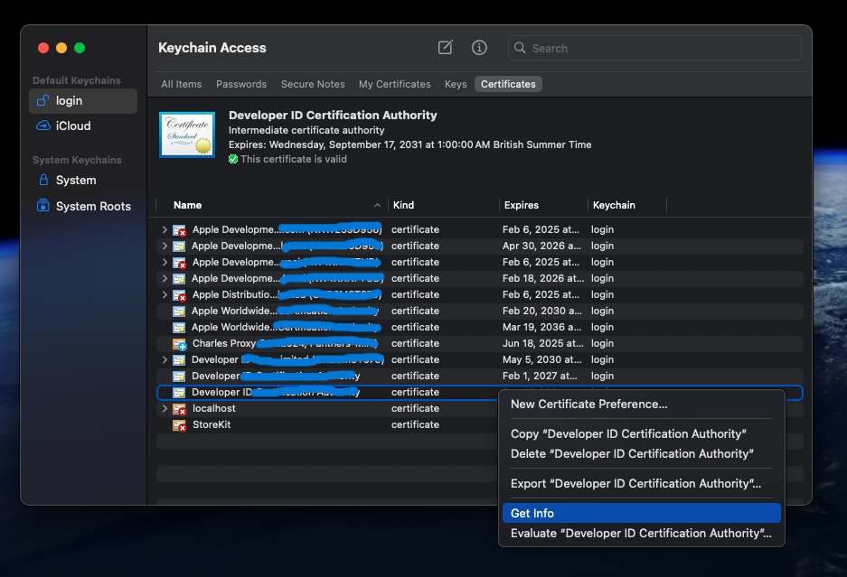

To sign and notarize your Unity-based macOS game using Apple's `notarytool`, follow these steps:

---

### ✅ Prerequisites

Ensure you have the following:

* **Xcode 13 or later** installed (includes `notarytool`).
* An active **Apple Developer Program** membership.
* A **Developer ID Application certificate** installed in your Keychain.

---

### 🔐 Step 1: Create a Keychain Profile for Authentication

Store your Apple ID credentials securely for use with `notarytool`:

```bash
xcrun notarytool store-credentials --apple-id "your-apple-id@example.com" --team-id "TEAMID" --password "app-specific-password" "AC_PASSWORD"
```


* Replace `"your-apple-id@example.com"` with your Apple ID.
* Replace `"TEAMID"` with your 10-character Team ID.
* Replace `"app-specific-password"` with an app-specific password generated from your Apple ID account.
* `"AC_PASSWORD"` is the name of the keychain profile;

This command stores your credentials securely in the keychain under the profile name `"AC_PASSWORD"`.

####How to find the details?

First Open up Keychain access
In the **Login** section in the sidebar, open the **credentials** tab
click on your Keychain Profile, and right click on it. Then choose **Get info**

****

By clicking on **Get Info** a window will be opened.
in the **detailes** section look for **UserID**, this is your `"TEAMID"`
Also you can find the `"AC_PASSWORD"` in **Organization** field

---

### 🛡️ Step 2: Code Sign Your Unity App

First we need to create a file with the extention of **.entitlements** with the following contents:

```bash
<?xml version="1.0" encoding="UTF-8"?>
<!DOCTYPE plist PUBLIC "-//Apple//DTD PLIST 1.0//EN" "http://www.apple.com/DTDs/PropertyList-1.0.dtd">
<plist version="1.0">
    <dict>
       <key>com.apple.security.cs.disable-library-validation</key>
       <true/>
       <key>com.apple.security.cs.disable-executable-page-protection</key>
       <true/>
    </dict>
</plist>
```

After building your Unity project for macOS, sign the `.app` bundle using your Developer ID certificate:

```bash
codesign --deep --force --verify --verbose --timestamp --options runtime --entitlements "YourApp.entitlements" --sign "Developer ID Application: YourTEAMID" "YourApp.app"
```


* Replace `"YourApp.entitlements"` with the path to your entitlements file.
* Replace `"YourApp.app"` with the path to your app bundle.

Ensure that the entitlements file includes necessary permissions for your app.

---

### 📦 Step 3: Prepare Your App for Notarization

Compress your signed app into a ZIP archive:

```bash
ditto -c -k --sequesterRsrc --keepParent "YourApp.app" "YourApp.zip"
```


This command creates `"YourApp.zip"` in the same directory.

---

### ☁️ Step 4: Submit Your App for Notarization

Use `notarytool` to submit your app for notarization:

```bash
xcrun notarytool submit "YourApp.zip" --keychain-profile "AC_PASSWORD" --wait
```


* `--keychain-profile "AC_PASSWORD"` uses the credentials stored earlier.
* `--wait` tells `notarytool` to wait for the notarization process to complete.

Upon successful notarization, you'll receive a confirmation message.

---

### 📎 Step 5: Staple the Notarization Ticket to Your App

After notarization, staple the ticket to your app to ensure it runs smoothly on users' systems:

```bash
xcrun stapler staple "YourApp.app"
```


This embeds the notarization ticket into your app bundle.

---

### ✅ Step 6: Verify the Stapled App

To confirm that the notarization ticket is properly stapled:

```bash
spctl --assess --type execute --verbose "YourApp.app"
```


A successful assessment will indicate that the app is notarized and ready for distribution.

---

By following these steps, your Unity-based macOS app will be properly signed and notarized using `notarytool`, ensuring a smooth experience for your users.

