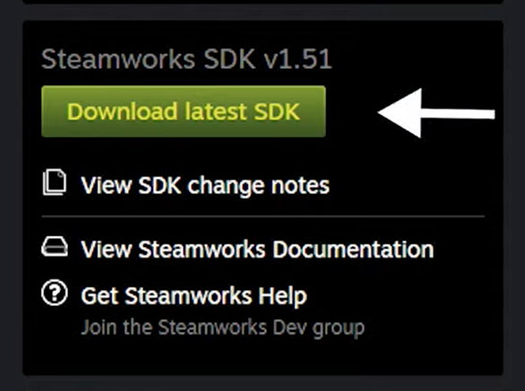
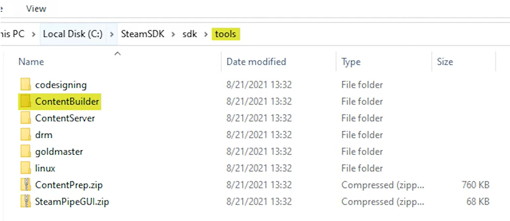
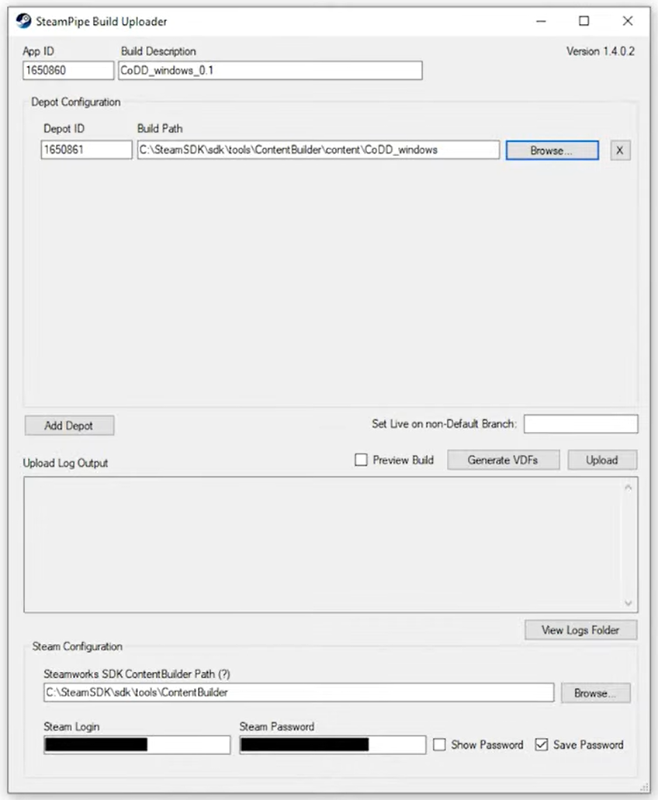

Below is a breakdown of the core Steamworks concepts you’ll encounter when uploading your Unity game to Steam: **Depots**, **Builds**, **Branches**, and **Packages**, plus the underlying tools (**SteamPipe** and **SteamCMD**) that glue them together. Each term is defined, then we show how they interrelate in the typical SteamPipe workflow.

---

## Summary

A **Depot** is a named group of files (game executables, assets, DLC, etc.) identified by a Depot ID . A **Build** is a snapshot of one or more depots at a specific point in time, representing exactly what users will download . A **Branch** (or Beta) is a named track (e.g. “default”, “beta”) that you can assign builds to, controlling which build version users on each branch receive . A **Package** is an SKU or license that bundles together applications and their depots for sale or key activation . Under the hood, **SteamPipe** (the content‑delivery system) and **SteamCMD** (the CLI tool) orchestrate uploading depots and builds, assigning them to branches, and bundling them into packages.

---

## Depots

- **Definition:**  
  A depot is a logical grouping of files that Steam delivers as a single unit. Each depot has a unique Depot ID and can represent your base game, DLC, language‑specific assets, or other add‑ons .  
- **Mounting Rules:**  
  Steam’s client “mounts” owned depots by priority: later‑listed depots override earlier ones. You can restrict depots to specific OSes or languages in the Steamworks UI .  
- **Use Case:**  
  Split your game into multiple depots (e.g., Windows vs. macOS builds, high‑res textures, DLC), so players only download what they own and need.

---

## Builds

- **Definition:**  
  A build is the result of uploading your content via SteamPipe; it bundles one or more depot revisions into a versioned snapshot. Builds record the exact set of files (manifest) users will get when they download that build .  
- **Uploading:**  
  Using SteamCMD or SteamPipe GUI, you run a build script (`app_build.vdf`) which references depot scripts (`depot_*.vdf`), sending content to Valve’s servers .  
- **Manifest:**  
  Each build generates a manifest listing file paths, sizes, and hashes. You can view manifests in the “Your Builds” page in App Admin .

---

## Branches (Betas)

- **Definition:**  
  Branches (also called Betas) are named channels—like “default”, “alpha”, “beta”—that you assign specific builds to. This lets you give testers early access without affecting the main release .  
- **Management:**  
  From the Builds page in App Admin, you create or rename branches and choose a password (optional) to gate access .  
- **Use Case:**  
  Push an experimental build to a “qa” branch or limited “pre‐release” tester group while keeping main users on the stable “default” build.

---

## Packages

- **Definition:**  
  A package (SKU/license) is a collection of one or more applications and their depots that customers purchase or redeem via key activation. It maps directly to what content a user owns .  
- **Types:**  
  - **Store + CD‑Key Package:** Default for selling in Steam store or via keys.  
  - **Store‑Only / CD‑Key‑Only Packages:** Limit a package to store sales or key activation.  
  - **Beta/Dev Comp Packages:** Special packages that grant content to tester or developer accounts without purchase .  
- **Relationship:**  
  When you define new depots or builds, you must add them to the appropriate package(s) to grant access to users (e.g., testers via Dev Comp, or buyers via Store package).

---

## SteamPipe & SteamCMD

- **SteamPipe:**  
  The HTTP‑based content delivery system for Steam. Instead of Valve manually pushing updates, developers upload builds and depots via scripts, and SteamPipe handles distribution and caching .  
- **SteamCMD:**  
  A command‑line version of the Steam client used to automate depot and build uploads. It reads your VDF scripts and pushes content to Steam’s servers .

---

With this understanding of depots, builds, branches, and packages—and by leveraging SteamPipe/SteamCMD—you can confidently structure and deliver your Unity game on the Steam platform.


---

## Uploading The Game

This section walks you through every step required to upload your Unity build to Steam via the SteamPipe GUI, plus some tips on directory structure, build scripts, and Store configuration.

### Prerequisites

- **Steamworks Partner Account** – Register and pay the one‑time fee to get your AppID.  
- **Steamworks SDK** – Download from your Steamworks dashboard:  
  - Unzip and locate the **Tools/ContentBuilder** folder.  
  
- **Unity Build** – A working standalone build (Windows/Mac/Linux) in its own folder.  

### Directory Layout

Your local `ContentBuilder` tree should look something like:

```text
ContentBuilder/
├── app_build.vdf
├── depot_123456.vdf
└── content/
    ├── depot_123456/      ← Put your game build here
    └── depot_123457/      ← Additional depots (e.g. DLC, Linux, Mac)
```



1. **`app_build.vdf`**  
   Describes your AppID, description, and list of depot scripts.  
2. **`depot_123456.vdf`**  
   Maps `content/depot_123456/` to Depot ID 123456.  
3. **`content/depot_123456/`**  
   Copy your built game files here (EXE, Data folder, DLLs, etc.).

### Step‑by‑Step Upload via SteamPipe GUI

1. **Run SteamPipeGUI.exe**  
   - Found in the unzipped `SteamPipeGUI.zip` under `Tools`.  
   - Double‑click to launch:

   

2. **Enter App ID & Build Description**  
   - **App ID:** Your Steam Application ID (e.g. `123456`)  
   - **Build Description:** A shorthand like “v1.0 Windows Initial Release”

3. **Configure Depots**  
   - In **Depot Configuration**, click **Add** and enter each Depot ID plus the local `content/depot_xxxxx/` folder:  

4. **Set ContentBuilder Path**  
   - At the bottom, browse to your unzipped `ContentBuilder/` folder.  
   - This tells the GUI where to find your `app_build.vdf` and depot scripts.

5. **Login Credentials**  
   - Enter your Steamworks username and password (or attach your SteamGuard key).  

6. **Generate VDFs (First‑Time Only)**  
   - Click **Generate VDFs** to create or update `app_build.vdf` and depot scripts.  
   - You only need to re‑generate if you add/remove depots or change paths.

7. **Upload**  
   - Hit **Upload** to kick off the SteamPipe process.  
   - A console window will show file hashes, transfers, and a **Build ID** upon success:  


8. **Verify in Dashboard**  
   - Go to your Steamworks **App Admin → SteamPipe → Builds**.  
   - Confirm the new Build ID, timestamp, and description appear.

### Post‑Upload Configuration

1. **Installation Settings**  
   - Under **App Admin → Installation**, configure launch options (e.g. `-screen-fullscreen 0`) and any required command‑line args.  

2. **Publishing the Build**  
   - In **SteamPipe → Builds**, click your Build → **Publish**.  
   - Assign it to your **default** or **beta** branch.  
   - Hit **Preview Change** to see which Steam users will get this build.  

3. **Branches & Beta Testing**  
   - Create additional branches (e.g. “beta”, “internal”) to isolate test builds.  
   - Set a password if you want private access for QA teams.  

---

## Updating The Game

When you have a new Unity build to push:

1. **Re‑Build in Unity**  
   - Bump your version number in **Player Settings** (e.g. v1.0.1).  
2. **Copy to ContentBuilder**  
   - Overwrite the contents of `ContentBuilder/content/depot_123456/` with your new build.  
3. **(Optional) Regenerate VDFs**  
   - Only if you’ve changed depot paths or IDs.  
4. **Upload via SteamPipe GUI**  
   - Repeat the upload steps—enter a new description like “v1.0.1 Hotfix” and click **Upload**.  
5. **Publish**  
   - Assign the new Build ID to the same branch (default or beta).  
   - Users will automatically get the update next time they start Steam.

---

### Tips & Tricks

- **Automate with SteamCMD:**  
  For CI/CD, you can script `steamcmd +login … +run_app_build … +quit` instead of using the GUI.  
- **Multiple Platforms:**  
  Create separate depots for Windows, Mac, and Linux to avoid cross‑platform downloads.  
- **Delta Transfers:**  
  SteamPipe only uploads changed files, so small hotfixes upload quickly.  
- **Error Logs:**  
  Check `ContentBuilder/logs/last_build.log` for detailed errors if an upload fails.

---

For more info, [check this video out](https://www.youtube.com/watch?v=gwMPvEFFomE)